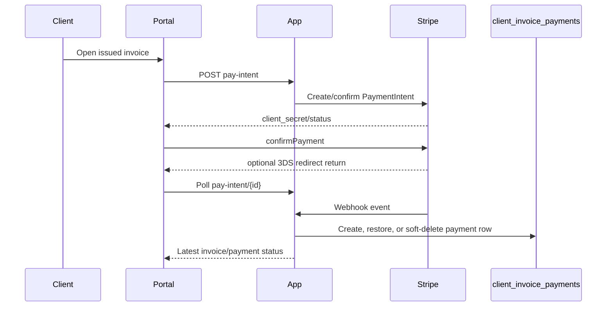

# Stripe Billing

Client invoices can be paid online through Stripe when the invoice is issued, has a remaining balance, and the invoice total is at or below the configured cap. The default cap is `100000` cents ($1,000) in `config/client-management.php`; larger invoices remain manual-only.

## Configuration

Set these environment values before enabling online payments:

```env
STRIPE_PUBLISHABLE_KEY=pk_test_...
STRIPE_SECRET_KEY=sk_test_...
STRIPE_WEBHOOK_SECRET=whsec_...
STRIPE_FINANCIAL_CONNECTIONS_ENABLED=false
```

Financial Connections is feature-gated and defaults off. The day-one flow still supports `us_bank_account`; enabling the flag lets Stripe collect bank-account credentials through Financial Connections permissions.

## High-Level Flow



`client_invoice_payments` remains the invoice payment ledger. Stripe-specific tables store customer IDs, saved method metadata, PaymentIntent activity, and webhook idempotency records.

## Client Portal

- `/client/portal/{slug}/billing` shows saved payment methods for the client company.
- Issued invoice pages show a payment panel for online-eligible invoices.
- Clients can pay with a saved method, a new card, a US bank account, or choose manual instructions.
- Saving a new method is explicit opt-in.
- 3DS and other redirect confirmations return to the invoice page, which polls `pay-intent/{id}` until the payment leaves `requires_action`.
- Failed online payment attempts are surfaced on the invoice payment panel.
- Saved methods are scoped to a client company and can be removed or marked default.

## Admin Surfaces

- Invoice detail shows Stripe activity, status, amount, failure reason, and the last Stripe event or poll marker.
- Issued invoice detail includes a copy-to-clipboard pay-link button for resending payment links manually.
- Invoice list filters include Stripe failures, using the latest failed or canceled Stripe payment for each invoice.

## Supported Events

Subscribe the Stripe webhook endpoint to these event types:

- `payment_intent.succeeded`: creates or restores a `ClientInvoicePayment`, then marks the invoice paid when the ledger covers the total.
- `payment_intent.processing`: records pending ACH/card state without marking the invoice paid.
- `payment_intent.payment_failed`: records `failure_reason` and logs `invoice.payment_failed`.
- `payment_intent.canceled`: records canceled state and logs `invoice.payment_failed`.
- `charge.refunded`: soft-deletes the original payment for full refunds; inserts a negative `stripe_refund` ledger row for partial refunds.
- `charge.dispute.created`: soft-deletes the Stripe payment row and reopens the invoice.
- `charge.dispute.closed`: restores the payment when the dispute is won; keeps it disputed when lost.
- `payment_method.attached`: syncs saved method metadata for the Stripe customer.
- `payment_method.detached`: soft-deletes the saved method locally.
- `setup_intent.succeeded`: syncs the saved method and records `payment_method.added`.

Duplicate events are ignored using the unique `client_invoice_stripe_events.stripe_event_id` record. Permanent app-side mismatches, such as a PaymentIntent referencing a deleted invoice, are recorded and acknowledged so Stripe does not retry indefinitely. Transient exceptions still return an error so Stripe retries.

## Stripe CLI Quickstart

Use the Stripe CLI for local webhook testing:

```bash
stripe login
stripe listen --forward-to http://127.0.0.1:8000/api/webhooks/stripe
```

Copy the printed `whsec_...` value into `STRIPE_WEBHOOK_SECRET`. Trigger smoke-test events with:

```bash
stripe trigger payment_intent.succeeded
stripe trigger payment_intent.payment_failed
stripe trigger charge.refunded
```

For invoice-specific tests, create the PaymentIntent through the portal so metadata includes `client_invoice_id` and `client_company_id`, then complete or refund it from the Stripe Dashboard or CLI.

## Replay Guidance

Webhook payloads are stored in `client_invoice_stripe_events.payload`. To replay a stored event safely:

1. Confirm the original event row has an `error` and no `processed_at`, or decide that reprocessing is intentional.
2. Delete or rename the stored `stripe_event_id` row before replaying, because duplicate event IDs are intentionally ignored.
3. Resend the event from the Stripe Dashboard or the Stripe CLI.
4. Verify `processed_at` is set and the corresponding `client_invoice_payments` ledger rows match the expected invoice state.

For one-off local debugging, prefer replaying through Stripe instead of manually editing ledger rows; the webhook path is the behavior under test.
